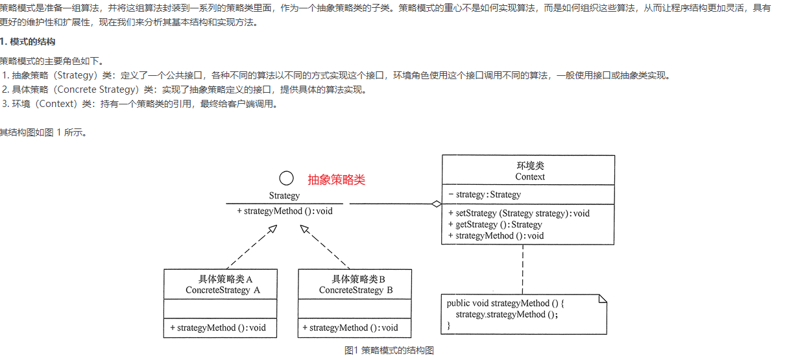
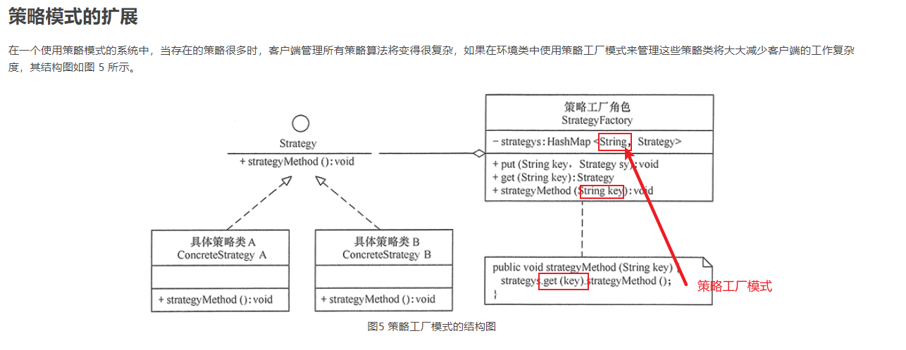

# 23种设计模式与六大原则

## 六大原则

面向对象设计原则 ：http://c.biancheng.net/view/1331.html

### 1.开闭原则

**对扩展开放，对修改关闭**

通过接口或者抽象类为软件实体定义一个相对稳定的抽象层，而将相同的可变因素封装在相同的具体实现类中


1.创建输入法实体类 SouGouInput

```java
public class SouGouInput {

    private AbstractSkin skin;

    public void setSkin(AbstractSkin skin) {
        this.skin = skin;
    }

    public void disploy(){
        skin.disploy();
    }
}

```

2.皮肤有多种 并且支持自定义 并且要遵守搜狗模板定义规则 故创建抽象皮肤类、

```java
public abstract class AbstractSkin {

    public abstract void disploy();
}
```

3.创建默认皮肤类和我的皮肤类，继承抽象类

````java
public class DefaultSkin extends AbstractSkin{
    @Override
    public void disploy() {
        System.out.println("默认皮肤");
    }
}
/////////////////////////////////////////////////////////////////////////////////////
public class MySkin extends AbstractSkin{
    @Override
    public void disploy() {
        System.out.println("自定义皮肤");
    }
}

````

4.测试类

````java
public class Test {
    public static void main(String[] args) {
        //创建输入法
        SouGouInput souGouInput = new SouGouInput();
        //创建皮肤
        DefaultSkin defaultSkin = new DefaultSkin();
        //设置皮肤
        souGouInput.setSkin(defaultSkin);
        //展示
        souGouInput.disploy();
    }
}
````

### 2.里氏替换原则

子类可以扩展父类的功能，但不能改变父类原有的功能(尽量不要重写父类的方法,或者说父类可以使用的方法子类也应该可以使用)

我的理解：在多个实体类实现某个接口方法时，应考虑接口中的方法是不是适合实现该接口的所有方法，例如：在鸟接口中有一个飞行的方法，但是鸵鸟不会飞，所以如果业务中出现需要鸟飞的方法并且实体类中包括鸵鸟等不会飞行的鸟时，该接口是不恰当的


1.数学概念上正方形是长方形 如果是继承关系，但是在扩宽方法上两者不能使用同一个方法，导致子类调用父类的方法，方法不能满足正方形，故不满足里氏替换原则 

```java
/**
 * @auther keer
 * @data 2021/10/25
 * @description 长方形
 */
public class Rectangle {
    private Integer length;
    private Integer width;

    public void setLength(Integer length) {
        this.length = length;
    }

    public void setWidth(Integer width) {
        this.width = width;
    }

    public Integer getLength() {
        return length;
    }

    public Integer getWidth() {
        return width;
    }
}
```

2.

```java
/**
 * @auther keer
 * @data 2021/10/25
 * @description 正方形
 */
public class Square extends Rectangle{

    @Override
    public void setWidth(Integer width) {
        super.setWidth(width);
        super.setLength(width);
    }

    @Override
    public void setLength(Integer length) {
        super.setLength(length);
        super.setWidth(length);
    }

}

```

3.测试类

```java
/**
 * @auther keer
 * @data 2021/10/25
 * @description
 */
public class RectangleDemo {

    public static void main(String[] args) {
        //长方形测试类
        Rectangle rectangle = new Rectangle();
        rectangle.setWidth(15);
        rectangle.setLength(20);
        resize(rectangle);
        printWidthAndLength(rectangle);
        System.out.println("++++++++++++++++++++++");
        //正方形测试类
        Square square = new Square();
        square.setLength(20);
        resize(square);
        printWidthAndLength(square);
    }
    //扩宽方法
    public static void resize(Rectangle rectangle){
        while (rectangle.getWidth() <= rectangle.getLength()){
            rectangle.setWidth(rectangle.getWidth()+1);
        }
    }
    //打印
    public static void printWidthAndLength(Rectangle rectangle){
        System.out.println("长"+rectangle.getLength());
        System.out.println("宽"+rectangle.getWidth());
    }
}
结果：正方形一直死循环
```

### 改进的里氏替换原则

改进：将实体类真正统一的方法写入接口 ，例如：长方形有长，宽，而正方形只有边长,换句话说正方形是没有长和宽。 他俩实现的接口只可以去get长与宽，对于set长与宽与扩宽业务冲突，不可写入接口 ，所以将类自己独特的方法写入类中，统一的长方形与正方形共有的方法写入接口


1.使用四边形抽象类，正方形长方形分别实现四边形接口的get方法 

```java
public interface Quadrilateral {
    Double  getLength();
    Double  getWidth();

}
```

2.长方形与正方形、

```java
/**
 * @auther keer
 * @data 2021/10/25
 * @description
 */
public class Rectangle implements Quadrilateral {
    private Double length;
    private Double width;

    public void setLength(Double length) {
        this.length = length;
    }

    public void setWidth(Double width) {
        this.width = width;
    }

    @Override
    public Double getLength() {
        return length;
    }

    @Override
    public Double getWidth() {
        return width;
    }
}

//////////////////////////////////////////////////////////////
/**
 * @auther keer
 * @data 2021/10/25
 * @description 正方形
 */
public class Square implements Quadrilateral {
    private Double size;

    public void setSize(Double size) {
        this.size = size;
    }

    public Double getSize() {
        return size;
    }

    @Override
    public Double getLength() {
        return size;
    }

    @Override
    public Double getWidth() {
        return size;
    }
}

```

3.测试类

```java
public class Test {
    public static void main(String[] args) {
        Rectangle rectangle = new Rectangle();
        rectangle.setLength(20D);
        rectangle.setWidth(15D);
        resize(rectangle);
        printWidthAndLength(rectangle);
        System.out.println("+++++++++++++++++++++++++");
        Square square = new Square();
        square.setSize(15D);
//        resize(square); 里氏替换
        printWidthAndLength(square);
    }
    //扩宽
    public static void resize(Rectangle rectangle){
        while (rectangle.getWidth() <= rectangle.getLength()){
            rectangle.setWidth(rectangle.getWidth()+1);
        }
    }
    //打印
    public static void printWidthAndLength(Quadrilateral quadrilateral){
        System.out.println("长"+quadrilateral.getLength());
        System.out.println("宽"+quadrilateral.getWidth());
    }
}

```

### 依赖倒置原则

依赖倒置原则的目的是通过要面向接口的编程来降低类间的耦合性（跟开闭原则蛮像的）

我的理解：一个类中的属性进行使用接口去定义，这样的类他的属性会更容易扩展


1.创建内存接口与实体类

```java
public interface Memory {
    void save();
}
//////////////////////////////////////////////////
public class KingstonMemory implements Memory{
    @Override
    public void save() {
        System.out.println("使用两个金士顿内存条");
    }
}
```

2.创建CPU接口与实体类

```java
public interface Cpu {
     void run();
}
//////////////////////////////////////
public class IntelCpu implements Cpu{
    @Override
    public void run() {
        System.out.println("英特尔处理器运行");
    }
}
```

3.创建硬盘接口与实体类

```java
public interface HardDisk {
    void save(String data);
    String get();
}
////////////////////////////////////////////

public class XiJieHardDisk implements HardDisk {
    @Override
    public void save(String data) {
        System.out.println("希捷硬盘储存"+data);
    }

    @Override
    public String get() {
        System.out.println("希捷硬盘获取数据");
        return null;
    }
}

```

4.将三者属性赋给computer

```java
public class Computer {
    Cpu cpu;
    HardDisk hardDisk;
    Memory memory;

    public void run(){
        System.out.println("运行计算机");
        cpu.run();
        hardDisk.get();
        memory.save();
        
    }
    public Cpu getCpu() {
        return cpu;
    }
    public void setCpu(Cpu cpu) {
        this.cpu = cpu;
    }
    public HardDisk getHardDisk() {
        return hardDisk;
    }
    public void setHardDisk(HardDisk hardDisk) {
        this.hardDisk = hardDisk;
    }
    public Memory getMemory() {
        return memory;
    }
    public void setMemory(Memory memory) {
        this.memory = memory;
    }
}

```

5.测试类

```java
public class Test {
    public static void main(String[] args) {
        Computer computer = new Computer();
        Memory kingstonMemory = new KingstonMemory();
        Cpu intelCpu = new IntelCpu();
        HardDisk  xiJieHardDisk = new XiJieHardDisk();
        computer.setCpu(intelCpu);
        computer.setHardDisk(xiJieHardDisk);
        computer.setMemory(kingstonMemory);
        //运行电脑
        computer.run();
    }
}
```

6.运行结果

```xml
运行计算机
英特尔处理器运行
希捷硬盘获取数据
使用两个金士顿内存条

Process finished with exit code 0
```

### 迪米特法则

如果两个软件实体无须直接通信，那么就不应当发生直接的相互调用，可以通过第三方（朋友）转发该调用。其目的是降低类之间的耦合度，提高模块的相对独立性

迪米特法则中的“朋友”是指：当前对象本身、当前对象的成员对象、当前对象所创建的对象、当前对象的方法参数等，这些对象同当前对象存在关联、聚合或组合关系，可以直接访问这些对象的方法。

我的理解:一个类与多个类之间有联系，并且需要联系。为了解耦使用一个相当于中转站的中间类（朋友），将这些有关系的类加入朋友的属性当中去，并使用方法使他们之间联系起来


1.创建粉丝，娱乐公司，明星类

```java
public class Company {
    private String name;

    public Company(String name) {
        this.name = name;
    }

    public String getName() {
        return name;
    }
}
/////////////////////////////////////////////////////
public class Fans {
    private String name;

    public Fans(String name) {
        this.name = name;
    }

    public String getName() {
        return name;
    }
}
///////////////////////////////////////////////////////
public class Star {
    private String name;

    public Star(String name) {
        this.name = name;
    }

    public String getName() {
        return name;
    }
}
```

2.经纪人类 在该类中将需要沟通的人加入属性中

```java
/**
 * @auther keer
 * @data 2021/10/26
 * @description经纪人
 */
public class Agent {
    Company company;
    Star star;
    Fans fans;
    //粉丝见面会
    public void meeting(){
        System.out.println(fans.getName()+"与"+star.getName()+"见面");
    }
    //公司商务合作
    public void working(){
        System.out.println(company.getName()+"与"+star.getName()+"合作");

    }

    public void setCompany(Company company) {
        this.company = company;
    }

    public void setStar(Star star) {
        this.star = star;
    }

    public void setFans(Fans fans) {
        this.fans = fans;
    }
}
```

3.测试

```java
public class Test {
    public static void main(String[] args) {
        Star star = new Star("周星驰");
        Company company = new Company("娱乐公司");
        //经纪人是他俩见面讨论合作事宜
        Agent agent = new Agent();
        agent.setCompany(company);
        agent.setStar(star);
        agent.working();
        System.out.println("+++++++++++++++++++++++");
        //经纪人开展粉丝见面会
        Fans fans = new Fans("粉丝");
        agent.setFans(fans);
        agent.meeting();
    }
}
```

4.测试结果

```java
娱乐公司与周星驰合作
+++++++++++++++++++++++
粉丝与周星驰见面

Process finished with exit code 0
    
```

### 合成复用性

合成复用原则是通过将已有的对象纳入新对象中，作为新对象的成员对象来实现的，新对象可以调用已有对象的功能，从而达到复用。


图二进行优化


## 创建型模式


## 结构型模式

### 策略模式

我的李姐：策略模式 的策略主要是根据抽象策略类中的抽象方法或者接口去生成规定好整体结构的几个策略，这些策略类是供人去选择的，就像一个多选选择题ABCD,答案是固定的，只需要在这些答案和策略中选择出一个即可，当然我们可以去扩展实现抽象策略类的不同策略，就像我们在ABCD中可以去扩展写出对应的EF选项，但这些选项都必须是这道题的正解





抽象策略类

```java
/**
 * @auther keer
 * @data 2021/11/1
 * @description 螃蟹做法大全
 * 抽象策略类：大闸蟹加工类
 */
public interface CrabCooking {
    void cookingMethod();
}

```

具体策略类

```java
/**
 * @auther keer
 * @data 2021/11/1
 * @description红烧大闸蟹
 * 具体策略类：红烧大闸蟹
 */
public class BraisedCrabs implements CrabCooking{
    @Override
    public void cookingMethod() {
        System.out.println("红烧大闸蟹简简单单做法");
    }
}
////////////////////////////////////////////////////
/**
 * @auther keer
 * @data 2021/11/1
 * @description清蒸大闸蟹
 * 具体策略类：清蒸大闸蟹
 */
public class SteamedCrabs implements CrabCooking {
    @Override
    public void cookingMethod() {
        System.out.println("清蒸大闸蟹简简单单做法");
    }
}
```

厨房（题目）

```java
/**
 * @auther keer
 * @data 2021/11/1
 * @description 环境类：厨房
 */
public class Kitchen {
    private CrabCooking crabCooking;

    public void CookingMethod(){
        crabCooking.cookingMethod(); //策略模式精髓
    }

    public CrabCooking getCrabCooking() {
        return crabCooking;
    }

    public void setCrabCooking(CrabCooking crabCooking) {
        this.crabCooking = crabCooking;
    }
}
```

Test

```java
public class CrabCookingStrategy  {
    
    public static void chooseMethod(String key){
        Kitchen kitchen = new Kitchen();//厨房
        if(key.equals("清蒸")){
            SteamedCrabs steamedCrabs = new SteamedCrabs();
            kitchen.setCrabCooking(steamedCrabs);

        }
        if(key.equals("红烧")){
            CrabCooking braisedCrabs = new BraisedCrabs();
            kitchen.setCrabCooking(braisedCrabs);
        }
        kitchen.CookingMethod();
    }

    public static void main(String[] args) {
        //策略（选择）
        chooseMethod("红烧");
    }
}
```

